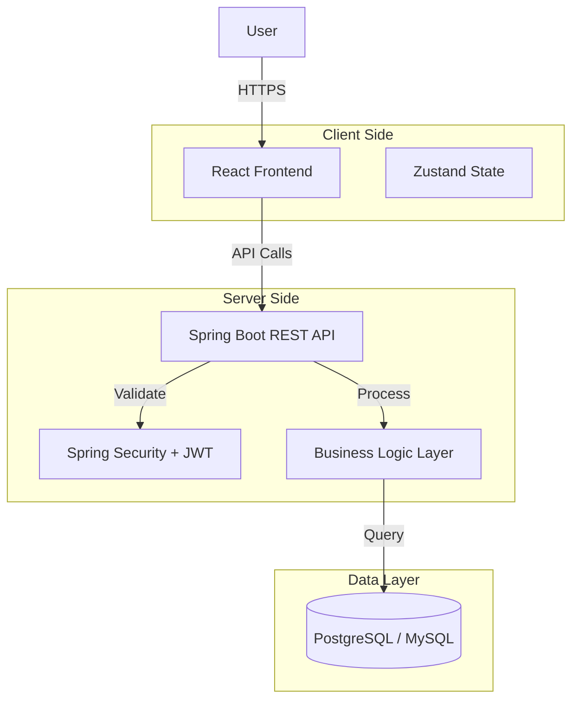

# Talentra - Campus Recruitment Management System


**Talentra** is a comprehensive Campus Recruitment Management System (CRMS) designed to digitize and automate the placement lifecycle. It connects **Students**, **Placement Officers**, and **Recruiters**, facilitating seamless job postings, eligibility-based applications, and interview management.

---

## 🏛 System Architecture

The application follows a robust **Spring Boot** backend with a **React** frontend.



---

## 📁 Project Documentation (New Scopes)

We have implemented formal project management and design documentation in the `/docs/project-scope/` directory:

1.  **[OOAD Scope](docs/project-scope/OOAD.md)**: Use Cases for job posting, applying, and shortlisting; Class Diagrams.
2.  **[SPM Scope](docs/project-scope/SPM.md)**: Resource allocation for recruitment seasons and high-traffic risk mitigation.
3.  **[ST Scope](docs/project-scope/ST.md)**: Detailed test cases for application processing, eligibility filtering, and scheduling.

---

## 🚀 Key Features

### 🎓 Student Portal
*   **Eligibility Filtering (AFL)**: Automatic checks for CGPA, Backlogs, and Department before applying.
*   **Interview Tracking**: Real-time status updates from recruiters.

### 🏢 Admin Command Center
*   **Drive Management**: Configure complex eligibility criteria for recruitment drives.
*   **ATS (Applicant Tracking System)**: Filter and shortlist candidates in bulk.

### 👔 Recruiter Interface
*   **Interview Scheduling**: Integrated scheduling for multiple interview rounds.
*   **Feedback Management**: Direct feedback submission for candidate performance.

---

## 🛠 Tech Stack

### Backend
*   **Java 17+**
*   **Spring Boot 3.x** (Data JPA, Security, Web)
*   **Lombok** (Boilerplate reduction)
*   **H2 / PostgreSQL** (Database)

### Frontend
*   **React 18** (TypeScript, Vite)
*   **Tailwind CSS** (Styling)
*   **Zustand** (State Management)
*   **Mermaid.js** (Diagrams)

---

## ⚙️ Getting Started

### 1. Backend Setup
```bash
cd backend
./mvnw clean install
./mvnw spring-boot:run
```
*   The backend will seed initial data via `DataSeeder.java`.

### 2. Frontend Setup
```bash
cd client
npm install
npm run dev
```

---

## 🧪 Testing

Run backend unit tests to verify eligibility logic:
```bash
cd backend
./mvnw test
```

Tests cover:
- Successful applications.
- CGPA threshold failures.
- Backlog limit failures.
- Department eligibility failures.
