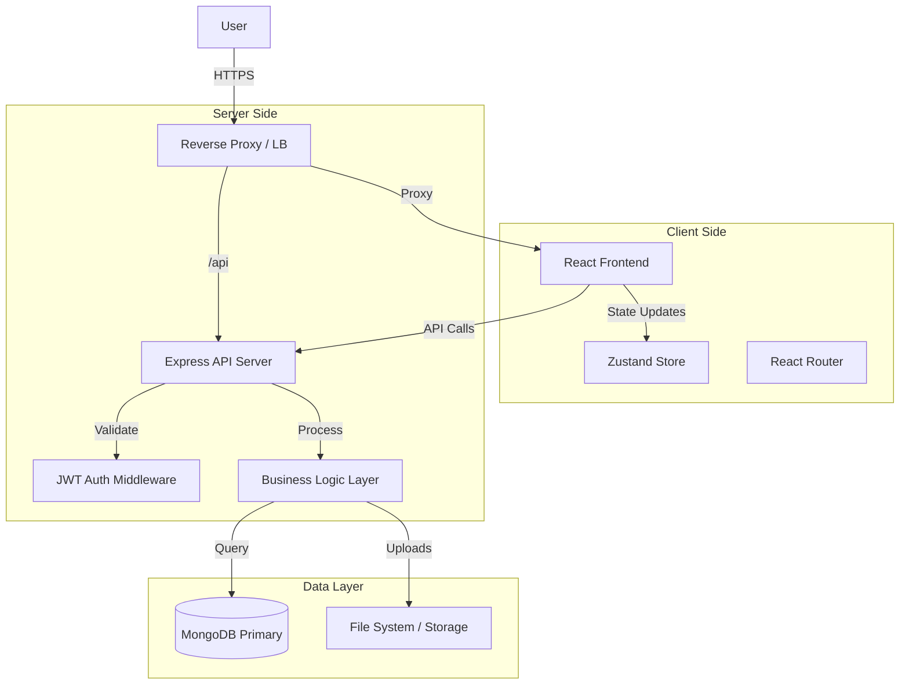

# Talentra - Campus Recruitment Management System


**Talentra** is an enterprise-grade Campus Recruitment Management System (CRMS) designed to digitize and streamline the entire placement lifecycle. It serves as a centralized platform connecting **Students**, **Placement Administrators**, and **Recruiters**, facilitating seamless job postings, application tracking, interview scheduling, and offer management.

---

## 🏗 System Architecture

The application follows a modern **Client-Server Architecture** with a RESTful API.



## 🚀 Features & Capabilities

### 🎓 Student Portal
*   **Smart Dashboard**: Real-time view of eligible drives, upcoming interviews, and application status.
*   **Profile Management**: Comprehensive academic profile building with resume handling.
*   **One-Click Apply**: Automatic eligibility checks before application submission.
*   **Resume Versioning**: Manage multiple versions of resumes (PDF).

### 🏢 Admin Command Center
*   **Drive Management**: Create and manage recruitment drives with complex eligibility logic (CGPA, Backlogs, Departments).
*   **Applicant Tracking System (ATS)**: Filter, shortlist, and manage students through the hiring funnel.
*   **Analytics Dashboard**: Visual insights into placement statistics, company participation, and student performance.
*   **Role Management**: Manage user roles and permissions.

### 👔 Recruiter Interface
*   **Candidate Review**: Access detailed profiles of shortlisted candidates.
*   **Interview Management**: Schedule and conduct interviews with integrated feedback forms.
*   **Status Updates**: Real-time status updates for candidates (Selected/Rejected).

---

## 🛠 Tech Stack Details

### Backend (Server)
*   **Runtime**: Node.js (v18+)
*   **Framework**: Express.js - Robust REST API framework.
*   **Database**: MongoDB (v4.4+) - NoSQL document store for flexible data modeling.
*   **ODM**: Mongoose - Schema-based modeling.
*   **Security**: `helmet` (Headers), `cors`, `express-rate-limit`, `bcryptjs` (Hashing), `jsonwebtoken` (Auth).
*   **Validation**: `joi` - Request payload validation.
*   **Logging**: `winston` - Production-grade structured logging.
*   **File Handling**: `multer` - Multipart/form-data handling for resumes.

### Frontend (Client)
*   **Core**: React 18, TypeScript, Vite (Build Tool).
*   **UI/UX**: Tailwind CSS, shadcn/ui (Accessible Components), Framer Motion (Animations), Lucide React (Icons).
*   **State Management**: Zustand - Minimalist and scalable state management.
*   **Data Fetching**: TanStack Query (React Query) - Caching, synchronization, and server state.
*   **Forms**: React Hook Form + Zod - Performant form validation.

---

## ⚙️ Configuration

The application uses environment variables for configuration. Ensure these are set in your production environment.

### Backend (`backend/.env`)

| Variable | Description | Default / Example | Required |
|----------|-------------|-------------------|:--------:|
| `PORT` | API Server Port | `5000` | Yes |
| `NODE_ENV` | Environment | `production` | Yes |
| `MONGODB_URI` | MongoDB Connection String | `mongodb://localhost:27017/talentra` | Yes |
| `JWT_SECRET` | Secret key for signing tokens | `complex_random_string` | Yes |
| `JWT_EXPIRE` | Token expiration time | `7d` | Yes |
| `UPLOAD_DIR` | Directory for file uploads | `./uploads` | Yes |
| `MAX_FILE_SIZE` | Max file upload size (bytes) | `5242880` (5MB) | No |
| `CLIENT_URL` | Frontend URL for CORS | `https://your-domain.com` | Yes |

### Client (`client/.env`)

| Variable | Description | Default / Example | Required |
|----------|-------------|-------------------|:--------:|
| `VITE_API_URL` | Full URL of the Backend API | `https://api.your-domain.com/api` | Yes |

---

## 💾 Installation & Setup

### 1. Prerequisites
Ensure you have the following installed:
*   **Node.js**: v18.0.0 or higher
*   **npm**: v9.0.0 or higher
*   **MongoDB**: v5.0 or higher (Running locally or via Atlas)
*   **Git**

### 2. Clone Repository
```bash
git clone https://github.com/Dharanish-AM/Talentra.git
cd Talentra
```

### 3. Backend Setup
```bash
cd backend
npm install --production=false # Install dev deps for building if needed, else npm ci --only=production
# For development/testing:
npm install

# Configure Environment
cp .env.example .env
nano .env # Edit variables
```

### 4. Client Setup
```bash
cd ../client
npm install

# Configure Environment
cp .env.example .env
nano .env # Set VITE_API_URL
```

---

## 🛥 Deployment Guide

### Option 1: Process Manager (PM2) - Recommended for VPS

1.  **Install PM2 globally**:
    ```bash
    npm install -g pm2
    ```

2.  **Build Frontend**:
    ```bash
    cd client
    npm run build
    # The output will be in client/dist
    ```

3.  **Serve Frontend**:
    You can use a simple static server with PM2 or Nginx.
    ```bash
    pm2 serve client/dist 5173 --name "talentra-client" --spa
    ```

4.  **Start Backend**:
    ```bash
    cd backend
    pm2 start src/index.js --name "talentra-api"
    ```

5.  **Save PM2 List**:
    ```bash
    pm2 save
    pm2 startup
    ```

### Option 2: Nginx Reverse Proxy (Production Standard)

It is highly recommended to use **Nginx** as a reverse proxy to serve the frontend static files and proxy API requests to the Node.js backend.

**Sample Nginx Configuration (`/etc/nginx/sites-available/talentra`):**

```nginx
server {
    listen 80;
    server_name your-domain.com;

    # Frontend (Static Files)
    location / {
        root /var/www/talentra/client/dist;
        index index.html;
        try_files $uri $uri/ /index.html;
    }

    # Backend API Proxy
    location /api {
        proxy_pass http://localhost:5000;
        proxy_http_version 1.1;
        proxy_set_header Upgrade $http_upgrade;
        proxy_set_header Connection 'upgrade';
        proxy_set_header Host $host;
        proxy_cache_bypass $http_upgrade;
    }
}
```

---

## 🧪 Testing & Quality Assurance

### Running Tests
We use **Jest** for backend testing and **Vitest** for frontend testing.

```bash
# Backend Tests
cd backend
npm test

# Client Tests
cd client
npm test
```

### Linting
Ensure code quality before committing:
```bash
# Backend Lint
cd backend
npm run lint

# Client Lint
cd client
npm run lint
```

---

## 👥 Contributing

We welcome contributions! Please follow these steps:

1.  **Fork** the repository.
2.  **Clone** your fork.
3.  **Create a branch**: `git checkout -b feature/amazing-feature`.
4.  **Commit** your changes: `git commit -m 'Add some amazing feature'`.
5.  **Push** to the branch: `git push origin feature/amazing-feature`.
6.  **Open a Pull Request**.

Please ensure all tests pass and linting errors are resolved before submitting.

---

## 📝 License

This project is licensed under the **MIT License**. See the [LICENSE](LICENSE) file for details.

---

**Maintained by [Dharanish-AM](https://github.com/Dharanish-AM)**
