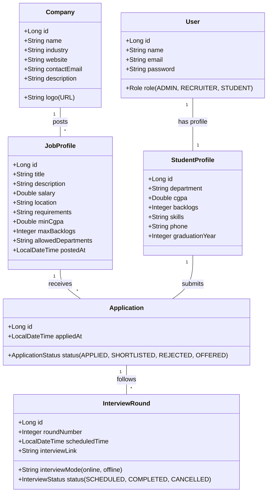

# Object-Oriented Analysis & Design (OOAD) - Talentra

This document outlines the core use cases and structural design of the Campus Recruitment Management System (Talentra).

## 1. Use Case Descriptions

### UC-01: Job Posting & Management

- **Actor**: Company Recruiter / Admin
- **Description**: Allows recruiters to create and publish new recruitment drives with specific eligibility criteria.
- **Pre-conditions**: Recruiter must be logged in.
- **Flow**:
    1. Recruiter clicks "Post Job".
    2. Recruiter enters title, description, salary, location, and requirements.
    3. Recruiter sets eligibility: Minimum CGPA, Maximum Backlogs, Allowed Departments.
    4. System validates and saves the `JobProfile`.
- **Post-conditions**: Job is visible to eligible students on their dashboard.

### UC-02: Job Application & Automated Filtering

- **Actor**: Student
- **Description**: Allows students to apply for recruitment drives that they are eligible for.
- **Pre-conditions**: Student must be logged in and have a completed profile.
- **Flow**:
    1. Student browses "Explore Drives".
    2. System dynamically filters drives based on student's current CGPA, Backlogs, and Department.
    3. Student clicks "Apply" on an eligible drive.
    4. System records the `Application` with the current timestamp.
- **Post-conditions**: `Application` status is set to `APPLIED`.

### UC-03: Candidate Shortlisting & Interview Flow

- **Actor**: Placement Officer (Admin) / Recruiter
- **Description**: Managing the applicant lifecycle from initial application to final offer.
- **Pre-conditions**: Applicants must exist for a drive.
- **Flow**:
    1. Authorized user views all applicants for a specific `JobProfile`.
    2. User applies filters or manually selects candidates.
    3. User updates status to `SHORTLISTED` and schedules an `InterviewRound`.
    4. System records the round details (Mode, Time, Link/Location).
    5. After the interview, user updates the status to `OFFERED` or `REJECTED`.
- **Post-conditions**: Application status and Interview records are synchronized.

## 2. Class Diagram

The following diagram illustrates the relationships and detailed fields between the core entities.

