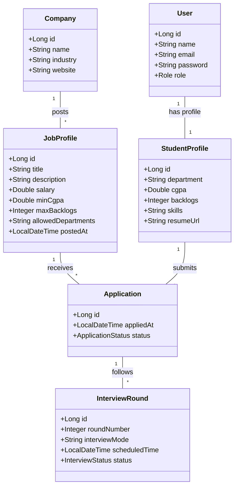

# Object-Oriented Analysis & Design (OOAD) - Talentra

This document outlines the core use cases and structural design of the Campus Recruitment Management System (Talentra).

## 1. Use Case Descriptions

### UC-01: Job Posting
- **Actor**: Company Recruiter / Admin
- **Description**: Allows recruiters to create and publish new recruitment drives with specific eligibility criteria.
- **Pre-conditions**: Recruiter must be logged in.
- **Flow**:
    1. Recruiter clicks "Post Job".
    2. Recruiter enters title, description, salary, and location.
    3. Recruiter sets eligibility: Minimum CGPA, Maximum Backlogs, Allowed Departments.
    4. System validates and saves the `JobProfile`.
- **Post-conditions**: Job is visible to eligible students.

### UC-02: Job Application
- **Actor**: Student
- **Description**: Allows students to apply for recruitment drives that they are eligible for.
- **Pre-conditions**: Student must be logged in and have a completed profile.
- **Flow**:
    1. Student browses "Eligible Drives".
    2. System filters drives based on student's academic metrics.
    3. Student clicks "Apply".
    4. System records the `Application`.
- **Post-conditions**: Application status is set to `APPLIED`.

### UC-03: Shortlisting & Filtering
- **Actor**: Placement Officer / Recruiter
- **Description**: Filters applicants based on criteria and updates their status for interview rounds.
- **Pre-conditions**: Applicants must exist for a drive.
- **Flow**:
    1. Officer views all applicants for a specific `JobProfile`.
    2. Officer applies filters (e.g., CGPA > 8.5).
    3. Officer selects candidates and clicks "Shortlist".
    4. System updates statuses to `SHORTLISTED`.
- **Post-conditions**: Shortlisted students are notified for interview scheduling.

## 2. Class Diagram

The following diagram illustrates the relationships between the core entities in the system.

