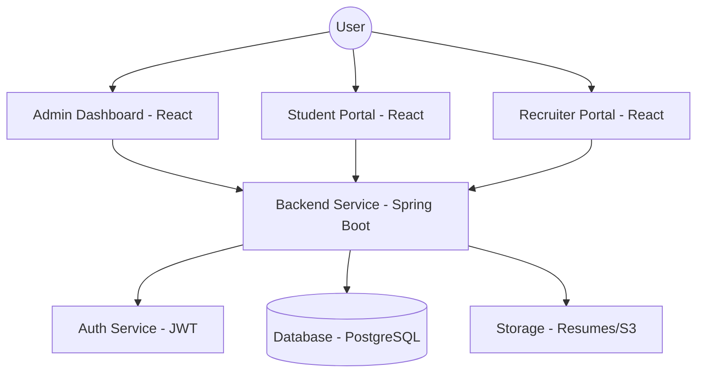

# Software Requirements Specification (SRS) - Talentra

**Project Name**: Talentra  
**Version**: 1.0.0  
**Date**: April 7, 2026  
**Standards**: IEEE 830 / IEEE/ISO/IEC 29148  

---

## 1. Introduction

### 1.1 Purpose
The purpose of this document is to provide a comprehensive description of the **Talentra** recruitment and placement management system. It outlines the functional and non-functional requirements, project scope, and system architecture for developers, stakeholders, and quality assurance teams.

### 1.2 Scope
Talentra is a web-based platform designed to streamline the campus recruitment and corporate hiring processes. It facilitates:
-   **Student Profile Management**: Academic details, resume hosting, and performance tracking.
-   **Job Drive Management**: Company onboarding, job profile creation, and eligibility filtering.
-   **Application Lifecycle**: Student applications, screening rounds, and interview scheduling.
-   **Administrative Oversight**: Dashboard metrics, system configuration, and placement analytics.

### 1.3 Definitions, Acronyms, and Abbreviations
| Term | Definition |
| :--- | :--- |
| **SRS** | Software Requirements Specification |
| **JPA** | Java Persistence API (Backend data mapping) |
| **JWT** | JSON Web Token (Authentication mechanism) |
| **RBAC** | Role-Based Access Control |
| **Drive** | A specific recruitment event launched by a company. |
| **Placement Officer** | The administrative user (Admin) overseeing the platform. |

### 1.4 References
-   IEEE 830-1998: IEEE Recommended Practice for Software Requirements Specifications.
-   ISO/IEC/IEEE 29148:2018: Systems and software engineering — Life cycle processes — Requirements engineering.

---

## 2. Overall Description

### 2.1 Product Perspective
Talentra is a standalone recruitment platform composed of a **Spring Boot** (Java) backend and a **React** (TypeScript) frontend. It interfaces with a **PostgreSQL** database for persistent storage and utilizes local or cloud storage (e.g., S3) for document management.

### 2.2 User Classes and Characteristics
| User Class | Description |
| :--- | :--- |
| **Admin** | High-level access. Manages companies, users, and system-wide placement metrics. |
| **Recruiter** | Corporate users posting job profiles, reviewing applicants, and conducting interviews. |
| **Student** | Primary users applying for jobs, managing their profiles, and tracking application status. |

### 2.3 Operating Environment
-   **Server**: Linux/Unix (compatible with Docker/Kubernetes).
-   **Database**: PostgreSQL 13+.
-   **Client**: Modern web browsers (Chrome, Firefox, Safari, Edge).
-   **Network**: Secured via HTTPS/TLS.

### 2.4 Design and Implementation Constraints
-   **Security**: Authentication via JWT; role-based authorization for all API endpoints.
-   **Language**: Java 17+ for backend; React for frontend.
-   **Data Consistency**: Strict adherence to relational database constraints.
-   **Concurrency**: Handling spikes during massive drive launches.

---

## 3. System Features

### 3.1 Authentication & Profile Management
-   **Registration/Login**: Multi-role login supporting Admin, Recruiter, and Student.
-   **Profile Setup**: Students can upload resumes and academic records; Recruiters can manage company branding.

### 3.2 Drive & Job Management
-   **Launch Drive**: Recruiters/Admins can create recruitment events with specific eligibility criteria (e.g., minimum CGPA).
-   **Job Profiles**: Detailed descriptions, salary packages, and location tags.

### 3.3 Application & Tracking
-   **One-Click Apply**: Students meeting criteria can apply directly.
-   **Status Pipeline**: Real-time tracking from "Applied" to "Selected" or "Rejected".

### 3.4 Interview Coordination
-   **Round Management**: Defining multiple rounds (Technical, HR, Managerial).
-   **Scheduling**: Assigning slots and tracking interview outcomes.

---

## 4. Functional Requirements

| ID | Feature | Description |
| :--- | :--- | :--- |
| **FR-AUTH-01** | User Authentication | Users shall log in with unique credentials and receive a JWT. |
| **FR-USER-02** | Role-Based Access | API access shall be restricted based on user roles (Admin, Student, Recruiter). |
| **FR-JOB-03** | Job Creation | Recruiters shall be able to create job profiles with eligibility rules. |
| **FR-APP-04** | Eligibility Check | The system shall validate a student's eligibility before allowing application submission. |
| **FR-INT-05** | Interview Status | Placement Officers shall update interview outcomes for each candidate. |
| **FR-REP-06** | Placement Reports | Admins shall export placement statistics (e.g., placement percentage, average salary). |

---

## 5. Non-Functional Requirements

### 5.1 Performance Requirements
-   **Response Time**: API responses for critical path operations (e.g., application submission) shall be < 500ms.
-   **Capacity**: Handle up to 1,000 concurrent students during drive launches.

### 5.2 Scalability
-   The backend shall be stateless to support horizontal scaling behind a load balancer.
-   Database indexing shall be optimized for frequent queries on `student_id` and `job_id`.

### 5.3 Security
-   Passwords must be salted and hashed (Bcrypt).
-   Resume storage paths must be obfuscated and served via secure links.

### 5.4 Reliability
-   The system shall maintain 99.9% availability during peak recruitment seasons.
-   Automated backups of the PostgreSQL database shall occur daily.

---

## 6. External Interface Requirements

### 6.1 User Interfaces (UI)
-   **Dashboard**: Intuitive, data-driven landing for all users.
-   **Responsive Design**: Optimized for desktop (admin/recruiter) and mobile-friendly (student).

### 6.2 Software Interfaces
-   **RESTful API**: JSON-based communication between frontend and backend.
-   **Storage Interface**: Interaction with the local file system or AWS S3 for document hosting.

---

## 7. System Architecture

---

## 8. Data Models

### 8.1 Entity-Relationship Overview
The system uses the following core entities:
| Entity | Key Attributes |
| :--- | :--- |
| **User** | ID, Email, Role, Password. |
| **Student** | UserID, CGPA, Branch, ResumePath. |
| **Company** | CompanyID, Name, Website, Industry. |
| **JobProfile** | JobID, CompanyID, Title, EligibilityCriteria. |
| **Application** | AppID, StudentID, JobID, Status (Applied/Screened/etc). |
| **Interview** | InterviewID, AppID, RoundName, Result. |

---

## 9. Assumptions and Dependencies
-   **Assumption**: Students have reliable internet access during drive launches.
-   **Dependency**: System relies on a consistent SMTP server for email notifications (if implemented).
-   **Dependency**: PostgreSQL server must remain reachable with low latency.
